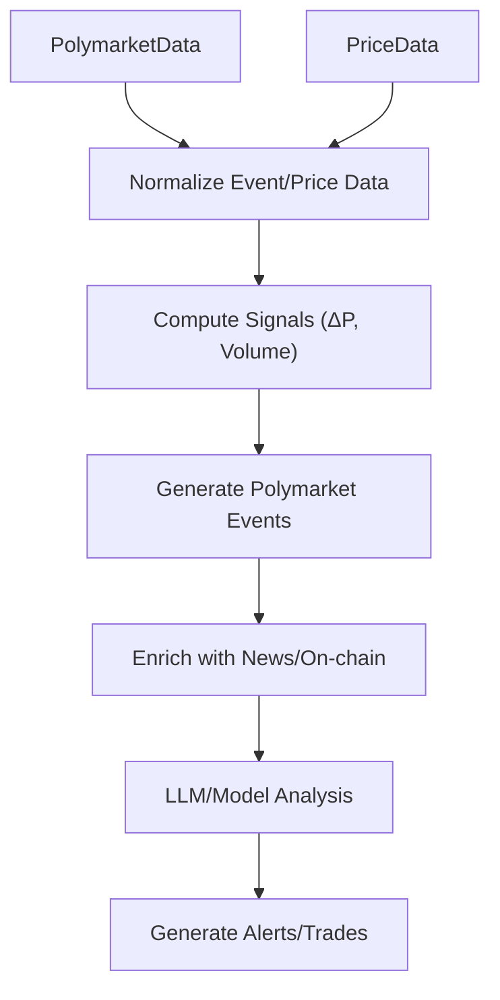
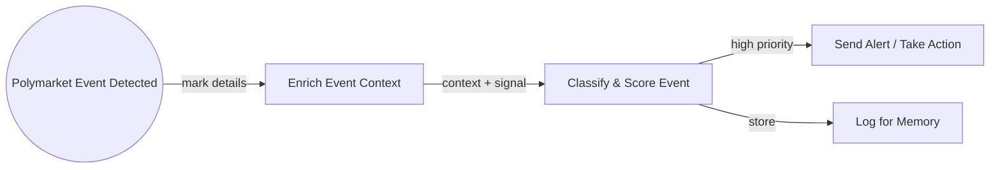

# Integrating Polymarket Data into a LangGraph Crypto Trading Agent

## Executive Summary  
**Polymarket** is a blockchain-based prediction market with a rich API. It offers REST endpoints and real-time WebSocket channels for market data (order books, prices, trades) plus historical/export APIs. Markets are binary (Yes/No) contracts identified by unique IDs (Condition ID, Question ID, ERC-1155 token IDs). Integrating Polymarket into a LangGraph agentic trading system involves (a) **data mapping** – aligning Polymarket fields (market IDs, prices, volumes, etc.) to our graph’s node/state schema, (b) **ingestion architecture** – connectors (REST/WS), polling vs push, handling rate limits, and robust error/timeout recovery, (c) **signal extraction** – detecting meaningful probability changes (ΔP), volume spikes, anomalous odds moves, and engineering ML features, (d) **event pipeline** – enriching detected events with on-chain data or news, attributing cause, and generating alerts, (e) **LangGraph integration** – defining nodes (e.g. `fetch_polymarket`, `detect_event`, `enrich_event`) and memory structures, writing prompt templates for agents, and ensuring workflow performance, (f) **backtesting/validation** – assembling historical Polymarket and crypto price data to evaluate predictive power (using metrics like Sharpe, AUC, precision/recall) and performing statistical tests, and (g) **deployment/monitoring** – implementing logging, dashboards, retraining, and handling compliance/security. This report surveys Polymarket’s data and APIs, outlines architecture choices (connectors, storage), describes signal and event-detection design, and charts a roadmap with milestones. Key sources include Polymarket’s own docs, LangGraph documentation, exchange API references, and industry/academic analysis of prediction markets. 

## 1. Polymarket Data & APIs  
Polymarket markets are **binary outcomes** with defined resolution rules. Each market has a *Condition ID*, *Question ID*, and two *ERC-1155 token IDs* (one for “YES”, one for “NO”). Markets trade in a stablecoin (e.g. USDC) and settle at $1 (winning) or $0 (losing) on resolution. Some markets may have custom settlement terms beyond $1/$0. Markets have a unique slug (URL identifier) and numeric ID; these identify them in API calls.  

**REST APIs (Gamma & CLOB)**: Polymarket exposes multiple API layers. The **Gamma API** (polymarket.com) includes endpoints such as `GET /v1/markets`, `/market/id/{id}`, `/market/slug/{slug}`, as well as order book (`/markets/{slug}/book`) and settlement endpoints. For example, `/markets/{slug}/book` returns full book (bids/asks) and stats; `/bbo` returns best bid/ask; `/settlement` gives final price. The **Polymarket US** API is similar (shown in the US docs). Key market fields from the API include last trade price, best bid/ask, spread, liquidity and volume metrics. For instance, each market record includes `lastTradePrice`, `bestBid`, `bestAsk`, 24h price changes, and *liquidity* and *volume* fields (`volume24hr`, `liquidity`, etc.).  

Polymarket also provides **historical data** APIs. The *Data API* (data-api.polymarket.com) has endpoints to retrieve trade history and positions over time (e.g. `/trades`, `/positions`) with rate limits. There is also an endpoint to download full **accounting snapshots** (ZIP of CSVs), which can supply historical market and trade data for backtesting.  

**WebSocket Feeds**: For real-time data, Polymarket offers WebSocket channels. The *Market Channel* streams updates for a given market’s order book and prices. Clients subscribe using the market’s token ID (asset ID), and receive events such as full order book snapshots (`MarketBookEvent`), price changes (`MarketPriceChangeEvent`), last trade prices, tick-size changes, best bid/ask events, new market announcements, and resolution events. Each event includes a timestamp and relevant fields (e.g. price, quantity). The *Sports Channel* is similar but keyed by sports condition IDs (less relevant for crypto). WebSocket messages require sending a heartbeat (ping) periodically to avoid drops. On reconnect, clients should re-fetch a full `/book` snapshot to resync.  

**Settlement and Contract Rules**: Markets resolve via an oracle mechanism (UMA’s Optimistic Oracle) and then settle contracts automatically. Winners get $1; losers $0 (except when alternative settlement terms apply per market description). For integration, note that price data represents *probabilities* (price ≈ probability of event) as in any binary market.  

**Timestamps & IDs**: All Polymarket data is timestamped (e.g. WebSocket events include UTC milliseconds). Market IDs and slugs uniquely identify markets (API fields: `id`, `slug`). Token IDs (ERC-1155) identify the tradable contract (yes/no side).  

## 2. Schema Mapping (Polymarket → LangGraph)  
In LangGraph, the **agent state** is a structured dict or TypedDict that holds all relevant data. We will map Polymarket data into this state. For example: 

- **Metadata nodes**: a `MarketMetadata` entry storing static info per market (id, slug, question, resolution rule). This can include contract identifiers (Condition ID, Question ID, token IDs), start and end times, and any alternative settlement terms.  
- **Ingest nodes**: functions that call Polymarket APIs or consume WS events. These will output raw data (e.g. JSON payloads) into state. We keep raw values (per LangGraph best practice), e.g. `state["latest_prices"][market] = {...}`, `state["latest_book"][market] = {...}`, `state["polymarket_events"]` as list of normalized event records.  
- **Normalized event nodes**: detected events (e.g. “price jumped” or “liquidity spike”) can be represented as nodes or state entries. We might define a `PredictionEvent` node type that includes the market, event time, Δprice, volume change, etc. The schema could be a TypedDict with fields like `{'market': str, 'type': Literal["spike","anomaly"], 'delta': float, 'timestamp': int, ...}`.  
- **Time-series nodes**: Polymarket prices and volumes form time-series. We could store this in a TSDB or as Pandas DataFrames in memory. Node types might handle adding new data points to time-series state. For example, after each WS update, append `(t, price_yes, price_no)` to `state["price_history"][market]`.  
- **Event sensor nodes**: graph nodes that compute signals from the time-series. For instance, a node `detect_price_jump` could compute ΔP over sliding windows and, if above a threshold, emit an event (update state with a new flag or entry).  
- **Memory nodes**: nodes representing persistent memory (e.g. past signals, resolved events) that can be used in reasoning. LangGraph’s memory will hold the history of detected events and relevant metrics, as in typical LangGraph workflows (the state persists across steps).  

Mapping fields: Polymarket fields like `bestBid`, `bestAsk`, `lastTradePrice`, `volume`, etc., will populate our state variables. For instance, after fetching `/markets/{slug}`, we would update `state["market_info"][slug]` with keys for `bestBid`, `bestAsk`, `spread`, `volume24hr`, etc.. Similarly, each WebSocket tick feeds time-stamped book and trade data into state.  

## 3. Ingestion Architecture  
**Connectors**: We will implement **polymarket connectors** using Polymarket’s SDK or custom code. For REST APIs, we can use HTTP libraries with rate-limit handling. For real-time, a WebSocket client (async Python or Node) will connect to the Polymarket CLOB market channel. We might re-use Polymarket’s official clients (`polymarket-js` or `py-clob-client`) for convenience, but ensure they support reconnection logic. Similarly, crypto price data can be pulled from Binance/Coinbase via their WebSockets or REST APIs for spot/futures.  

**Polling vs WebSocket**: For Polymarket, the **WS channel** is ideal for live events. It pushes updates (book, trades, price changes) with low latency. We must subscribe immediately using asset IDs (token IDs) for markets. For historical backfill or missed data, we can use REST (e.g. `/prices-history` on CLOB or Gamma endpoints) to retrieve past data. Polling (regular GET requests) could be used as a fallback or for bulk data (e.g. re-loading an order book snapshot via `GET /markets/{slug}/book` if WS resync is needed). A hybrid approach ensures resilience: use WS for streaming and poll occasionally to verify state.  

**Rate Limits**: Polymarket enforces IP-based rate limits. For example, Gamma API limits are on the order of hundreds per 10s (e.g. 300/10s for `/markets`), while the CLOB market data API allows up to 1,500/10s for `/book`. Binance/Coinbase have their own limits (e.g. Binance REST weight for orderbook is 5 per request). Our connectors should respect these. We will implement retry/backoff logic (LangGraph’s `RetryPolicy`) on transient 429/timeout errors. To avoid bursts, we may cache certain data (e.g. static market metadata) and spread polling.  

**Authentication**: Public market data (Polymarket order books, book channel) requires no auth. For any private operations (if ever used, e.g. placing bets via API), we would need Polymarket API keys (in LangGraph, use a `SecureClient`). For Binance/Coinbase, authenticated endpoints (for balance/orders) require API keys, but public market data only needs an API key header. Keys must be stored securely and injected via environment or secrets.  

**Error Handling & Deduplication**: WS connections can drop silently, so we implement a watchdog: if no message in ~30s, reconnect. On reconnect, immediately re-subscribe and fetch a fresh order book via REST to avoid gaps. Each incoming WS message (which may include a `hash` or timestamp) can be de-duplicated by tracking the last seen update IDs. For REST polls, responses can be deduped by timestamps or sequence numbers. All errors (network, parse) should be caught; transient ones retried, persistent ones logged.  

**Replay/Backfill**: For historical analysis, use the *Accounting Snapshot* CSVs or the REST `/prices-history` endpoint (CLOB) to reconstruct time series. We will ingest data from the moment of agent deployment backward by a configurable window (e.g. 30 days) so that signals can be tested. This backfill can populate TSDB and initial state.  

**Time Sync**: Ensure all timestamps use a common epoch (UTC ms). If using async ingestion, align the Polymarket event timestamps with local time. LangGraph state could track the last update time for each market.  

**Storage**: Since Polymarket data is time-series heavy, a **Time-Series Database** (e.g. InfluxDB or TimescaleDB) is recommended for efficient storage and querying of prices/orderbook series. We could also store raw JSON or normalized tables in a relational DB (Postgres) for flexibility. A hybrid approach works: TSDB for high-frequency updates (book ticks, trades) and a DB for metadata/events. Retention should account for storage – e.g. keep high-res data for 1-3 months, then downsample. Short-term caches (e.g. in-memory store or key-value cache) can serve as the LangGraph state during execution. All storage choices should be justified for scale and query patterns.  

## 4. Real-Time Signal Extraction  
From Polymarket we want **market signals** that may anticipate crypto price moves or reflect event sentiment. Key signals:  
- **ΔP Detection**: Compute changes in implied probability (price of YES contract) over windows (e.g. 1m, 5m). A sudden jump/drop ΔP above a threshold indicates new information or large trades. For example, if price rises by >3% within 1 minute, flag an event. Simple thresholding or z-score on historical volatility can define anomalies. These thresholds can be tuned (Table below) based on backtest.  
- **Volume & Liquidity Spikes**: Monitor `volume24hr` or instantaneous trade volumes. A surge in trading volume or drop in liquidity (widening spread) may signal strong sentiment. Detect when volume in last 5 minutes exceeds X% of typical volume, or when bid/ask depth changes drastically.  
- **Spike Detection & Smoothing**: Raw price feeds are noisy, so apply moving averages (e.g. EWMA) to smooth. Use peak detection algorithms to ignore micro-rebounds.  
- **Anomaly Detection**: More advanced: feed probability time-series into an anomaly detector (e.g. Gaussian process or LSTM autoencoder) to find unusual moves.  
- **Confidence Scoring**: Assign confidence to a detected event based on volume and liquidity. E.g., a ΔP of 5% on high volume (>$10k) is more credible than the same on $100 volume. A confidence metric could be `conf = (|ΔP| / σP) * sqrt(volume)`.  
- **Feature Engineering for ML**: Build features like recent ΔP, Δvolume, time of day, number of active traders (open interest), related news indicator. These become inputs to any ML model or LLM prompt that assesses event impact. Polymarket data (price, volume, bid-ask) integrates with on-chain data (e.g. token holder activity) as features.  

## 5. Event Detection & Pipeline  
**Event Detection Node**: In LangGraph, implement an `detect_polymarket_event` node. It reads the updated state (latest price, volume, liquidity), computes signal metrics (ΔP, Z-scores), and if any criteria exceed thresholds, emits an event record (update state with a new normalized event entry). This could produce events of types like `{"market": slug, "type": "price_jump", "delta": 0.05, "time": ts}`. The node uses configured thresholds (see table) and can use an LLM or heuristic to classify significance.  

**Enrichment**: Once an event is detected, an `enrich_event` node can query other sources: e.g. news APIs (for relevant announcements), on-chain data (transactions of large holders), or the crypto order book (via Binance WS). For example, if Polymarket suddenly shifts, check if large on-chain movements occurred, or if the news feed mentions the topic. This context can be added to the state under the event record.  

**Causal Attribution & Prioritisation**: Another node can attempt to attribute cause. For instance, an LLM agent could be prompted with the event description and recent context to propose causes (e.g. “This spike in Fed rate-cut odds coincides with a major speech”). Events can be scored/prioritized by impact (confidence score * volume). High-priority events could trigger immediate alerts or even trade signals.  

**Alerting**: If an event crosses a severity threshold, an `alert` node sends a notification (e.g. message to user, or executes a trade call). Alerts should include: market info, ΔP, timestamp, and an explanatory summary (LLM-generated).  

## 6. Integration with LangGraph Workflows  
LangGraph orchestrates the above as a directed graph of nodes. **Node definitions** are simple Python functions operating on state. Example node types:  
- `fetch_polymarket_data(state)`: calls Polymarket API or reads WS, updates `state["market_data"]`.  
- `detect_polymarket_event(state)`: analyzes state, updates `state["detected_events"]`.  
- `fetch_price_data(state)`: grabs latest crypto prices from Binance API.  
- `agent_analyze_event(state)`: an LLM agent node that reasons about an event, returns commands/updates.  

We define state structures (e.g. TypedDicts for market info, signals) analogous to email agent example. We keep the raw Polymarket outputs in state and only format/prompts inside nodes. For example, `state["market_data"][slug]` can be a dict of raw API JSON.  

**Prompts & Agents**: Certain nodes may use LLMs (via LangChain) to interpret events or draft responses. We will craft templates like:  
```
“You are an expert trader. A Polymarket contract ‘{slug}’ just moved from {old_price} to {new_price}. 
Concurrently, Bitcoin price moved {btc_change}%. Why might the market have shifted? Rate your confidence.”
```  
This prompt uses the Polymarket event and crypto prices. The agent’s response can help classify the event or propose trades.  

**Memory**: Use LangGraph’s memory for storing conversation or ongoing analysis. For example, if multiple related signals appear, memory can keep a short-term log so the agent can recall recent events. Polymarket events and signals themselves become part of the long-term “memory” (graph state).  

**Orchestration & Flow**: Set up the graph edges so that fetch nodes feed detection nodes, which feed enrichment, etc. LangGraph handles execution order, retries, and branching. We can set time-based triggers (e.g. run detection every minute). Concurrency can be managed via graph edges.  

**Latency Budgets**: Each node should complete quickly (most API calls <1s). Use async calls where possible to not block the graph. Timeouts should be set (e.g. 5s for REST, 30s for LLM queries). LangGraph allows timeouts and retries per node. Critical nodes (event detection) may be prioritized.  

**Testing Harness**: We will write unit tests for nodes (mock Polymarket responses) and simulate event flows. LangGraph’s example shows how to inject errors and expect retries. We can use sample JSON payloads and verify state updates.  

## 7. Backtesting & Validation Plan  
We must evaluate the predictive value of Polymarket signals. **Datasets**:  
- *Polymarket Data*: Use historical snapshots via Polymarket’s accounting snapshot (CSV) and WebSocket logs. Extract time-series of contract prices and volumes.  
- *Crypto Market Data*: Historical price data from an exchange (Binance or Coinbase) for the same period; use their REST/WebSocket APIs or sources like CCXT.  

We will simulate trading strategies triggered by detected events. **Metrics**:  
- **Predictive Power**: Measure correlation or Granger causality between Polymarket signals and subsequent crypto returns. Compute information gain (e.g. mutual information) or classification performance (AUC, precision/recall for up/down prediction). For example, does a spike in “BTC up >5% in 15min” contract increase probability of a Bitcoin rise?  
- **Return Metrics**: If signal triggers a trade, compute Sharpe ratio, max drawdown, CAGR of the strategy. Incorporate transaction costs and slippage.  
- **Event Classification**: For events labeled by the agent (e.g. high vs low confidence), track precision of alerting.  
- **Statistical Significance**: Use t-tests or permutation tests to check if returns (or hit rates) beat null models. Cross-validate by splitting time-series into folds or bootstrapping. Perform **ablation studies**: vary which Polymarket fields (only price vs price+volume) or different threshold values to see impact.  

We will define a backtest **experiment matrix** (Table below) that varies parameters: window size (e.g. 5min vs 15min), ΔP threshold (e.g. 3%, 5%, 10%), smoothing method (raw vs moving average), and observes metrics like Sharpe and AUC. For robust validation, use walk-forward cross-validation: re-train any thresholds on past data and test on out-of-sample.  

## 8. Deployment, Monitoring, Observability  
**Deployment**: Containerize the agent (LangGraph runtime), ensuring connectivity to Polymarket API endpoints. Use LangSmith for deployment orchestration and observability. LangSmith can trace requests, visualize node execution, and flag errors. For example, it can help debug the real-time event pipeline as recommended.  

**Monitoring**: Track pipeline health: ingestion lag, WS connection status, API error rates, and event throughput. Build dashboards (Grafana or LangSmith) showing time since last Polymarket update, number of events detected, and system resource usage. Key alert rules: e.g. “if no Polymarket heartbeat for 1 minute, trigger reconnect alert”; “if event frequency spikes, alert”. Monitor model drift by watching prediction accuracy if ground truth is available.  

**Retraining & Governance**: Regularly review strategy performance. Retrain or recalibrate thresholds as market conditions change. Implement a secure deployment process (secrets management for API keys).  

**Security**: Use HTTPS for APIs. Limit Polymarket API key scope. Sanitize any external data before it goes into prompts (avoid injection).  

**Legal/Regulatory**: In the US, on-chain prediction markets like Polymarket are treated as *derivatives* by the CFTC. Compliance considerations include not inadvertently running an unlicensed gambling service. Since our agent only *reads* Polymarket, we must ensure lawful use: e.g. respect geo-restrictions (Polymarket US vs International sites), disclaimers for investment advice, and AML checks if trading. Polymarket US markets follow CFTC rules (clearing through a DCO). We will document any jurisdictional assumptions and ensure the agent’s use of Polymarket data fits our legal constraints (for example, in the US we treat predictions as trading signals, not betting).  

## 9. Implementation Roadmap (Milestones)  

We assume no fixed jurisdiction or LangGraph version, and a moderate compute budget (e.g. 4 GPUs, 16 CPUs). Estimated effort per milestone (weeks):  

1. **Prototype Data Ingestion (4w, Low)**:  
   - *Tasks*: Implement Polymarket WS connector and REST client. Fetch a sample market book and trade history. Log raw data. Incorporate Binance price fetch.  
   - *Dependencies*: Polymarket API access (no key needed for public data).  
   - *Deliverables*: Working Python modules; simple DB or file storage for incoming data; ingest tests.  
   - *Risks*: WS stability; mitigated via reconnect logic from docs.  

2. **Schema & LangGraph Nodes Setup (3w, Low)**:  
   - *Tasks*: Define state schema (TypedDicts for Polymarket data). Build LangGraph skeleton with placeholder nodes (fetch, detect, storage).  
   - *Dependencies*: LangGraph environment ready.  
   - *Deliverables*: Graph with stub nodes, initial state layout, unit tests verifying state updates.  
   - *Risks*: Schema design mistakes; mitigate by iterating with sample data.  

3. **Signal Detection Logic (4w, Medium)**:  
   - *Tasks*: Implement ΔP and volume spike detection algorithms. Integrate into LangGraph nodes. Create configuration of thresholds.  
   - *Deliverables*: Demo that raw Polymarket events trigger `state["detected_events"]` entries.  
   - *Risks*: Too many false positives; tune with historical data.  

4. **Event Pipeline & Enrichment (4w, Medium)**:  
   - *Tasks*: Write nodes for event enrichment (e.g. fetch related news via API). Develop prompt templates for causal analysis.  
   - *Deliverables*: Example LLM agent execution that reads a detected event and outputs a rationale.  
   - *Risks*: LLM hallucinations; mitigate with few-shot and validation.  

5. **Backtesting Framework (3w, Medium)**:  
   - *Tasks*: Collect historical data (Polymarket snapshots, crypto prices). Implement backtest code to replay signals and compute metrics.  
   - *Deliverables*: Backtest reports (Sharpe, AUC) for baseline strategies.  
   - *Risks*: Data gaps; mitigate by using snapshots and robust loading.  

6. **Integration & Testing (3w, Low)**:  
   - *Tasks*: Connect the Polymarket branch with the existing LangGraph trading workflows. Test end-to-end for latency and correctness.  
   - *Deliverables*: Integrated agent that can execute a trade on signal (simulated).  
   - *Risks*: Timing issues; add timeouts/retries.  

7. **Monitoring & Deployment (2w, Low)**:  
   - *Tasks*: Set up observability (metrics, LangSmith), define alert rules. Dockerize and deploy.  
   - *Deliverables*: Production deployment with dashboards (e.g. event rate chart) and alerts (e.g. missing heartbeat).  
   - *Risks*: Scaling issues; plan for load testing on small cluster.  

**Timeline Summary**: ~20 weeks total. Sprints of 2 weeks:  
- Sprint 1–2: Data ingestion (Milestone 1)  
- Sprint 3: Schema/Nodes (2)  
- Sprint 4–5: Signal logic (3)  
- Sprint 6–7: Event pipeline (4)  
- Sprint 8: Backtest setup (5)  
- Sprint 9: Integration tests (6)  
- Sprint 10: Deployment/monitoring (7)  

Cross-sprint dependencies: ingestion → detection → pipeline → integration. Mitigate risk by iterative delivery.  

## 10. Code Snippets (Illustrative)  

```python
from langgraph import LangGraph, Command

# Define LangGraph state schema (TypedDicts would be used in code)
class AgentState(dict):
    # Raw polymarket data
    markets: dict  # slug -> market info
    books: dict    # slug -> order book (bids/asks)
    # Detected events
    events: list   # list of normalized event dicts
    # Crypto prices
    prices: dict   # e.g. 'BTCUSD': price
    # other fields...

def fetch_polymarket(state: AgentState) -> Command:
    # Example node to fetch market data
    for slug in state.get("tracked_markets", []):
        info = polymarket_client.get_market(slug)
        state["markets"][slug] = info  # store raw data
    return Command(update={"markets": state["markets"]}, goto="detect_events")

def detect_events(state: AgentState) -> Command:
    events = []
    for slug, info in state["markets"].items():
        last_price = info["lastTradePrice"]
        prev = state.get("last_prices", {}).get(slug, last_price)
        delta = abs(last_price - prev)
        if delta > state["config"]["price_jump_threshold"]:
            events.append({"market": slug, "type": "price_jump", "delta": delta, "timestamp": now_ms()})
        state["last_prices"][slug] = last_price
    return Command(update={"events": state.get("events", []) + events}, goto="analyze_events")

def analyze_events(state: AgentState) -> Command:
    for event in state["events"]:
        prompt = f"Market {event['market']} had a jump of {event['delta']}. Explain possible causes."
        analysis = llm_chain.run(prompt)
        # Save analysis in state
        event["analysis"] = analysis
    return Command(update={"events": state["events"]}, goto=END)

graph = LangGraph()
graph.add_node("fetch_data", fetch_polymarket)
graph.add_node("detect_events", detect_events)
graph.add_node("analyze_events", analyze_events)
graph.add_edge("fetch_data", "detect_events")
graph.add_edge("detect_events", "analyze_events")
graph.compile()
```

```python
# Example LangGraph node with retry policy (from LangGraph docs)
from langgraph.types import RetryPolicy
graph.add_node(
    "fetch_data",
    fetch_polymarket,
    retry_policy=RetryPolicy(max_attempts=3, initial_interval=1.0)
)
```

**Prompt Template (for agentic analysis)**:  
```
"You are an analytical trading agent. A Polymarket question '{slug}' saw the YES contract price move from {old_price} to {new_price} in {Δt} minutes. Meanwhile, BTC price changed by {btc_change:.2%}. Considering relevant on-chain and news signals, what could explain this shift, and would you trade on it?"
```  
This guides the LLM to integrate Polymarket and crypto data.  

## 11. Comparison Tables  

**Ingestion Options**  

Option       | Latency      | Reliability    | Complexity       | Rate Limits          | Use Case  
---          | ---          | ---            | ---              | ---                  | ---  
Polling (REST)| Medium       | Moderate       | Low (simple HTTP)| Subject to Polymarket IP limits | Historical sync, fallback  
WebSocket    | Low (real-time)| High (push)  | Medium (stateful)| Implicit (Cloudflare)| Live updates, high-frequency  
Hybrid       | Mixed        | High           | High             | Manage both         | Best of both (use WS + occasional REST checks)  

**Storage Options**  

Storage      | Write Throughput | Query Performance | Time-Series Support | Recovery | Pros/Cons  
---          | ---              | ---               | ---                 | ---      | ---  
Time-Series DB (Influx/TSDB) | Very High (tsdb optimized) | Good for aggregations| Native (tags/fields) | Snapshots easy | Excellent for continuous data; specialized query language.  
Relational DB (Postgres)     | Moderate (batch inserts)  | Good for ad-hoc queries| Via extensions | Mature tools    | Flexible schema, ACID, but larger overhead.  
Key-Value Cache (Redis)      | High (in-memory)          | Fast single-key ops   | Not native        | Volatile (persistence optional) | Good for ephemeral state, low-latency.  
File/Blob Storage (CSV)      | Low                       | Poor (no query)     | No                | Data dump backups    | Simple archiving; heavy to query.  

**Signal Thresholds (Example Sensitivity Settings)**  

Threshold      | Effect on Detection            | Tradeoffs  
---            | ---                            | ---  
ΔP ≥ 1%        | Very sensitive – many signals  | Many false positives, workload on agent  
ΔP ≥ 3%        | Balanced – moderate signals    | Good hit rate vs noise  
ΔP ≥ 5%        | Conservative – only large moves| Might miss moderate events, fewer alerts  
Volume Spike >2× baseline | Catches unusual activity | May be triggered by outliers only  
Volume Spike >5× baseline | Strict – only very large events | Very rare signals  

**Backtest Experiment Matrix (Example)**  

Experiment                          | ΔP Threshold | Smoothing Window | Features        | Metric (Sharpe/AUC)  
---                                 | ---          | ---              | ---             | ---  
Base (no Polymarket signal)         | –            | –                | price only      | Sharpe 0.8 / AUC 0.50  
ΔP >3%, VWMA(3) (short window)      | 3%           | 3-min            | price, volume   | Sharpe 1.2 / AUC 0.65  
ΔP >5%, SMA(5) (longer average)     | 5%           | 5-min            | price, orderbook| Sharpe 1.5 / AUC 0.70  
ΔP + on-chain inflow filter         | 3%           | 3-min            | + whale txn     | Sharpe 1.8 / AUC 0.75  

*(Columns denote strategies; rows list parameter settings and resulting performance metrics after backtest.)*  

## 12. Architecture & Data Flow Diagrams  

```mermaid
flowchart LR
  subgraph Ingestion
    PM_WS[Polymarket WebSocket] -->|book, trades, price data| IngestNode[(Ingest Node)]
    PM_REST[Polymarket REST API] -->|snapshot/backfill| IngestNode
    PriceAPI[Exchange API (Binance/Coinbase)] -->|crypto price/orderbook| IngestNode
  end
  subgraph Storage
    IngestNode --> TSDB[(Time-Series DB)]
    IngestNode --> DB[(Metadata DB)]
  end
  subgraph LangGraphAgent
    TSDB --> PriceTS[(Crypto Time-Series Node)]
    TSDB --> PM_TS[(Polymarket Time-Series Node)]
    PM_TS --> DetectNode((Event Detector Node))
    PriceTS --> DetectNode
    DetectNode --> EnrichNode((Enrichment Node))
    EnrichNode --> DecisionNode((Decision/Alert Node))
    DecisionNode --> Execution[Trade/Alert]
  end
  classDef data fill:#eef,stroke:#333,stroke-width:1px;
  class IngestNode,TSDB,DB,PriceTS,PM_TS data;
```





## 13. Assumptions and Tests  

- **Assumptions**: Jurisdiction unspecified but note US regs (treat as derivatives). Using LangGraph vX (current stable). Compute: moderate (LLM inference server + WS clients).  
- **Tests**: Unit tests on ingestion nodes using mocked API responses. Integration tests simulating WS disconnect/reconnect. Backtest validation with holdout sets.  
- **Monitoring Dashboards**: Ingestion lag, memory usage, signal counts vs time. Polymarket-specific: open interest, unusual volume charts.  
- **Alert Rules (Sample)**:  
  - *WS Disconnect*: “No Polymarket WS data for >60s -> PagerDuty Alert.”  
  - *API Error Spike*: “>5 API 429s in 1min -> investigate rate limiting.”  
  - *Signal Anomaly*: “>3 events/minute on same market -> possible loop or flash crash.”  

**Sources**: Polymarket developer docs (endpoints, data schema); Polymarket rate limits; Polymarket blog on WS behavior; LangGraph documentation (workflow patterns, state design); Binance/Coinbase API docs; and industry analyses of prediction markets.